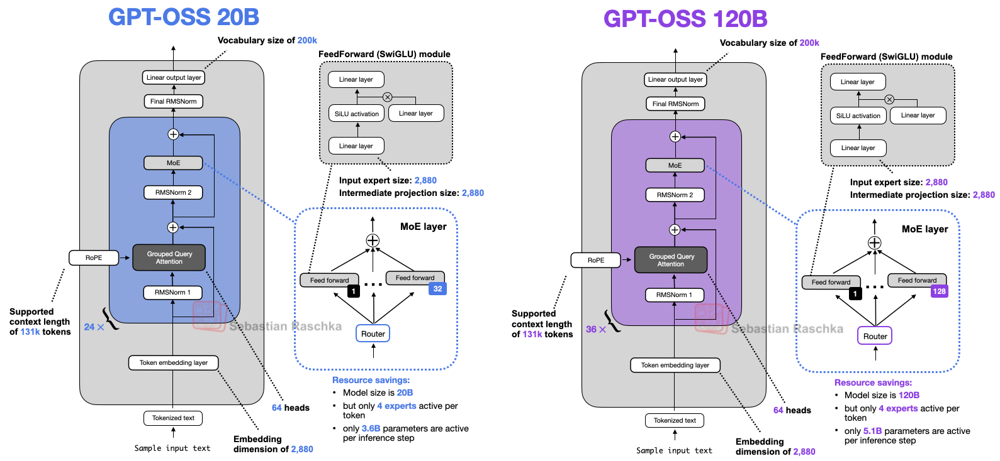

<div align="center">

# GPT-OSS from Scratch on AMD GPUs

### A dependency-free C++/HIP inference engine for OpenAI's GPT-OSS 20B & 120B Mixture-of-Experts models

</div>

---

## 👋 Introduction

This is a pure **C++/HIP** implementation of OpenAI's **GPT-OSS** models, designed to **maximize inference throughput on AMD GPUs without relying on external libraries**. Our goal is to explore end-to-end LLM optimization — from kernel-level improvements to system-level design — providing insights for anyone interested in high-performance computing and model-level optimization.

Inspired by [llama2.c](https://github.com/karpathy/llama2.c), the engine is written in **HIP** (AMD's CUDA-equivalent programming model) and deliberately avoids dependencies such as **rocBLAS, hipBLAS, RCCL, and MPI** — every GEMM, attention kernel, and cross-GPU collective is hand-written. We apply a broad set of optimizations across the 20B and 120B models: efficient model loading, request batching, multi-streaming, hand-rolled multi-GPU communication, tuned CPU–GPU–SRAM memory access, **FlashAttention**, **matrix-core (MFMA) GEMM**, and **load balancing for MoE routing**.

On a single node with **8× AMD MI250 GPUs**, the engine reaches roughly **40k TPS** on the 20B model and **13.6k TPS** on the 120B model in our custom benchmarks — demonstrating the effectiveness of the optimizations and the strong potential of AMD GPUs for large-scale LLM inference.

---

## 🚀 Performance Benchmarks

Measured on a single node with **8× AMD MI250 (gfx90a)** GPUs:

| Model          | Throughput (TPS) | METEOR | BERTScore |
| :------------- | :--------------- | :----- | :-------- |
| `gpt-oss-20b`  | **39,120**       | 0.48   | 0.97      |
| `gpt-oss-120b` | **13,663**       | 0.34   | 0.97      |

Throughput is end-to-end tokens/second across the full batch; METEOR and BERTScore measure output quality against reference generations (see [Evaluation](#4-evaluate)).

---

## 📁 Repository Layout

| Path | Description |
| :--- | :--- |
| [`getp-csrc/`](getp-csrc/) | The inference engine: kernels, GEMM, FlashAttention, MoE, collectives, allocation, and the `getp_run` / `getp_eval` entry points. |
| `getp-csrc/benchmarks/` | Standalone micro-benchmarks (`gemm_bench`, `flash_attn_bench`) and profiling artifacts. |
| [`export_model_bin/`](export_model_bin/) | Per-model exporters (7m / 20b / 120b) that convert HuggingFace safetensors into a single flat `.bin`. |
| [`dequantize_model/`](dequantize_model/) | Utility to dequantize MXFP4 checkpoints to bf16 safetensors. |
| [`evaluation/`](evaluation/) | METEOR / BERTScore evaluation harness, reference outputs, and thresholds. |
| `export_tokenizer_bin.py` | Exports the tiktoken `o200k_harmony` vocabulary to `tokenizer.bin`. |
| `decode.cpp` | Helper to decode a line of token IDs back to text. |
| `analyze.py` | Aggregates per-layer timing logs into a profile. |
| `data/` | Sample input / output. |

---

## 🛠️ Optimization Strategy & Techniques

Every tensor operation — from GEMM to MoE routing to the cross-GPU collectives — was written and tuned by hand, without high-level BLAS/DNN/communication libraries.

### ⚡ FlashAttention (HIP)

- Custom single-query (decode) **FlashAttention** with online softmax (running max/sum), a **bf16 KV cache** read as packed `uint32` pairs, `fmaf` accumulation, and 64-wide warp reductions (`src/flash_attn_hip.cpp`).
- Two launch paths: a **fused tiled kernel** for long contexts and a **flash-decoding split-K** path (partial max/sum + stable reduce) for short ones.
- **Attention sinks** folded into the final normalization, and **sliding-window attention** applied on alternating (even) layers.

### 🧮 Matrix-Core (MFMA) GEMM

- Hand-written wave-tiled GEMMs on AMD **matrix cores** via MFMA intrinsics (`__builtin_amdgcn_mfma_f32_16x16x16bf16_1k`, `..._16x16x4f32`) with `f32x4` accumulators, LDS double-buffering, register K-prefetch, and vectorized `uint4` bf16 loads (`src/matrix_core.cpp`).
- Production tiling `BM=128, BN=128, BK=32, TM=TN=32` (512 threads/block), tuned per operator, with dedicated **grouped MoE** variants that index rows by per-expert offsets.

### 🧠 Mixture-of-Experts — Routing & Load Balancing

- Router GEMM → **top-4** softmax gating, then a **counting-sort** grouping of tokens by expert (`atomicAdd` counts → prefix sum → scatter) so each expert runs a single contiguous grouped GEMM slice (`src/kernel.cpp`).
- Fused **SwiGLU** with clamp, weighted scatter-add back into the token aggregate, and grid bounds derived from the busiest expert to balance work.

### 🔗 Multi-GPU Communication — No RCCL / No MPI

- All-pairs **P2P peer access** enabled at warm-up; collectives are hand-implemented over `hipMemcpyPeerAsync` and direct peer-buffer reads (`src/parallelism.cpp`).
- **Ring all-reduce** (reduce-scatter + all-gather), all-gathers, and recursive-doubling variants — with **fp8-quantized payloads on the wire** to cut inter-GPU bandwidth.

### 🧵 Batching, Streaming & Pipelining

- Fully **batched** pipeline (up to thousands of sequences), greedy argmax decode with per-sequence early stop on EOS.
- One **HIP stream per device**, cross-device ordering via HIP events, host-side coordination via pthread barriers.
- **Pipeline-parallel** machinery (bounded producer/consumer activation queues) is present and event-gated.

### 💾 Memory & Precision

- Weights and activations in **bf16**, fp32 accumulation, **fp8** for inter-GPU reduction payloads, and a **bf16 KV cache** split into even/odd (sliding-window vs full) layer buffers.
- Tiles staged in LDS/shared memory, vectorized `uint4` / `uint32` loads, and `__restrict__` throughout; RoPE fused into the QKV split/store.

---

## 🧠 Model Architecture

<div align="center">

<br/>
<sub>GPT-OSS <b>20B</b> (24 blocks, 32 experts) and <b>120B</b> (36 blocks, 128 experts)</i></sub>
</div>

On top of this structure, our engine implements the GPT-OSS attention specifics — **per-head attention sinks**, **sliding-window attention on alternating layers**, and **RoPE with YaRN scaling** — backed by a **bf16 KV cache**.

### Parallelism Strategy (8× MI250)

| | **20B** | **120B** |
| :--- | :--- | :--- |
| **Scheme** | Data Parallel (DP=8) | Tensor + Expert Parallel (TP=8) |
| **GPU layout** | Full model replicated on each GPU; 1 pthread + 1 stream per GPU | Single data path spanning all 8 GPUs |
| **Sharding** | None — replicated | Heads/hidden sharded; experts partitioned across GPUs |
| **Inter-GPU comms** | None on the forward path (requests split into 8 chunks) | Per layer: fp8 ring all-reduce (attention out), fp8 ring-reduce (MoE aggregate), all-gathers (activations & logit IDs) |

---

## ⚙️ End-to-End Usage

### Prerequisites

- ROCm with **`hipcc`** (the Makefile falls back to `g++` if hipcc is absent)
- AMD GPU (`gfx90a` / MI250); an 8-GPU node to reproduce the reported throughput
- Python 3 with `torch` (ROCm), `transformers`, `tiktoken`, `nltk`, `bert-score` for export/evaluation

### 1. Prepare the model binary

```bash
# (optional) dequantize an MXFP4 checkpoint to bf16
python dequantize_model/dequantize_to_bf16.py 20b

# export HuggingFace safetensors -> a single flat .bin
python export_model_bin/gpt-oss-20b/export_model_bin.py \
    --input  $MODELS_ROOT/gpt-oss-20b/original/model.safetensors \
    --config export_model_bin/gpt-oss-20b/config.json \
    --output gpt-oss-20b.bin
```

### 2. Build the engine

```bash
make runomp     # hipcc -O3 -fopenmp -march=native --offload-arch=gfx90a
```

This also generates `tokenizer.bin` via `export_tokenizer_bin.py`. The target model (20B vs 120B) is selected at compile time through the macros in `getp-csrc/include/config.hpp`.

### 3. Run batched inference

```bash
# 20B on 8 GPUs
srun -N 1 --gres=gpu:8 ./run gpt-oss-20b.bin  -m getp -i data/input.txt -o data/output.txt

# 120B on 8 GPUs
srun -N 1 --gres=gpu:8 ./run gpt-oss-120b.bin -m getp -i evaluation/input.txt \
    -o evaluation/submission/output_120b_token_ids.txt
```

The `-m getp` mode runs the batched-evaluation path: the input file starts with the number of requests, followed by one prompt per line; the engine warms up, times inference, prints achieved TPS, and writes generated token IDs.

### 4. Evaluate

```bash
cd evaluation
srun --gres=gpu:2 python eval.py -m 20b     # or -m 120b
```

Evaluation decodes submission and reference token IDs, computes **METEOR** and **BERTScore-F1**, and checks them against `evaluation/threshold.json`.

---

## 🙏 Acknowledgments

This project was part of the **GPU Engineer Training Program**, a collaboration between [Moreh](https://www.linkedin.com/company/moreh-inc) and the [THUNDER Research Group](http://snuvm.snu.ac.kr/) at Seoul National University.
